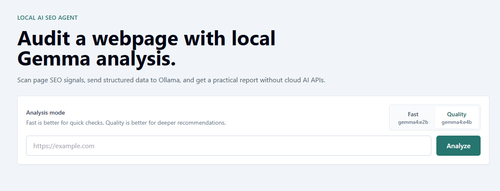
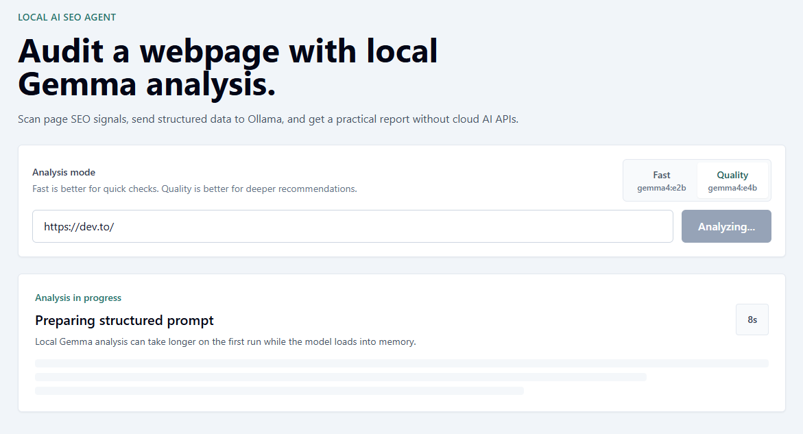
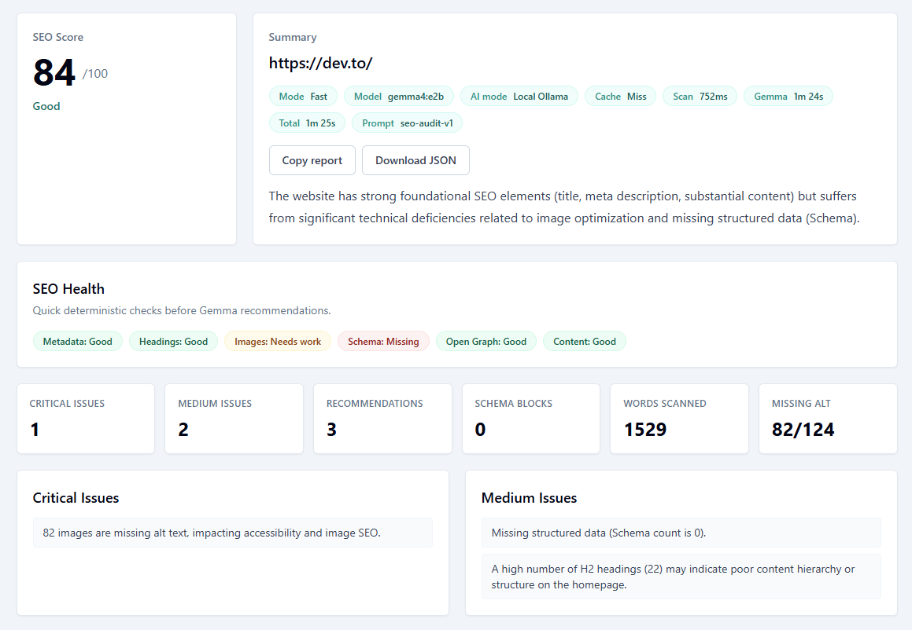
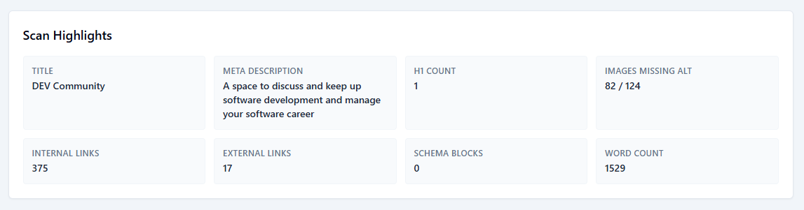
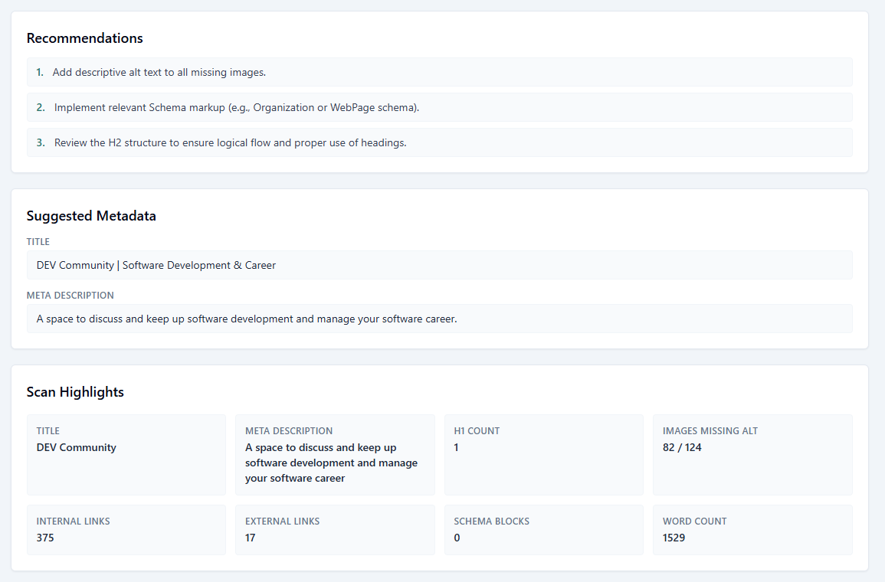
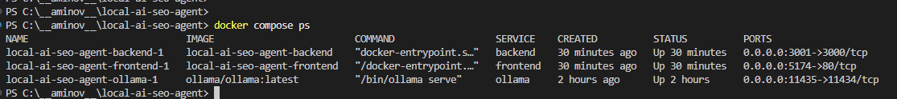

# Local AI SEO Agent

A privacy-friendly SEO audit tool that runs AI analysis locally with Gemma through Ollama.

The app scans a public webpage, extracts SEO signals, sends structured data to a local Gemma model, and displays a clear SEO report without using cloud AI APIs.

Repository:

```txt
https://github.com/avi-aminov/local-ai-seo-agent
```

DEV submission:

```txt
https://dev.to/avraham_aminov_542e8309b6/building-a-local-ai-seo-agent-with-gemma-ollama-docker-and-react-303j
```

## Workflow

```txt
URL -> SEO scan -> Gemma via Ollama -> structured AI report -> React UI
```

## Stack

- Frontend: React, TypeScript, Vite, TailwindCSS
- Backend: Node.js, Express, TypeScript, Axios, Cheerio, Zod
- Local AI: Ollama, Gemma
- Infrastructure: Docker Compose

## Features

- Single-page SEO audit from a public URL
- Metadata extraction: title, meta description, canonical, robots, viewport
- Heading analysis from `h1` through `h6`
- Image alt attribute checks
- Internal, external, and empty link counts
- Open Graph extraction
- JSON-LD schema detection
- Content length and word count estimate
- Local Gemma analysis through Ollama
- Fast/Quality model mode selection
- Copy report and Download JSON actions
- SEO health badges for deterministic checks
- Structured AI response validation
- SEO score, issues, recommendations, and suggested metadata
- Docker Compose setup

## Example Output

```json
{
  "success": true,
  "data": {
    "url": "https://example.com",
    "finalUrl": "https://example.com/",
    "analysis": {
      "score": 85,
      "summary": "The page has solid metadata and content depth, but needs structured data and stronger heading hierarchy.",
      "criticalIssues": [],
      "mediumIssues": [
        "Schema markup is missing, which can reduce eligibility for rich results."
      ],
      "recommendations": [
        "Add LocalBusiness or Organization schema where relevant.",
        "Expand heading hierarchy with descriptive H2 and H3 sections.",
        "Review internal links and ensure key pages are reachable."
      ],
      "suggestedTitle": "Example Page - Clear Product or Service Value",
      "suggestedMetaDescription": "A concise search-friendly summary of the page content and value."
    },
    "runtime": {
      "model": "gemma4:e4b",
      "mode": "quality",
      "localAi": true,
      "scanDurationMs": 1200,
      "aiDurationMs": 90000,
      "totalDurationMs": 91200,
      "cacheHit": false,
      "promptVersion": "seo-audit-v1"
    }
  }
}
```

## Architecture

```txt
React UI
  -> Express API
  -> SEO scanner
  -> prompt builder
  -> Ollama
  -> Gemma
  -> JSON validator
  -> report UI
```

The frontend never talks directly to Ollama. The backend owns validation, scanning, AI orchestration, and response formatting.

## Screenshots

### Homepage



### Loading State



### SEO Report



### Scan Highlights



### Recommendations



### Docker Containers



## Development

Backend:

```bash
cd server
npm install
npm run dev
```

Frontend:

```bash
cd client
npm install
npm run dev
```

Default URLs:

- Frontend: http://localhost:5173
- Backend: http://localhost:3000
- Ollama: http://localhost:11434 locally, or http://localhost:11435 through Docker Compose

Docker Compose exposes the app on separate host ports so it can run beside local dev servers:

- Frontend Docker: http://localhost:5174
- Backend Docker: http://localhost:3001
- Ollama Docker: http://localhost:11435

## Environment

Backend `server/.env`:

```env
PORT=3000
OLLAMA_URL=http://localhost:11434
OLLAMA_MODEL=gemma4:e4b
OLLAMA_TIMEOUT_MS=180000
REPORT_CACHE_TTL_MS=900000
```

Frontend `client/.env`:

```env
VITE_API_URL=http://localhost:3000/api
```

## Docker

Target command:

```bash
docker compose up
```

Default model:

```txt
gemma4:e4b
```

This tag was selected because it is a Gemma 4 edge model with stronger reasoning capacity than the smallest variant while still being practical for local development.

Pull the model into the Docker Ollama service:

```bash
docker compose exec ollama ollama pull gemma4:e4b
```

## Limitations

- The MVP analyzes one page at a time.
- JavaScript-rendered content is not executed.
- Full Lighthouse/Core Web Vitals analysis is not included.
- First local model response can be slow while Gemma loads into memory.
- Repeated URL analysis uses an in-memory cache by URL and model for faster demos.
- AI output is validated, but recommendations should still be reviewed by a human.

## Future Features

- Multi-page crawling
- Sitemap support
- Report history
- PDF export
- Lighthouse integration
- Browser extension
- WordPress plugin

## Contest Note

This project is being built for the DEV Gemma 4 Challenge. It uses Gemma as the reasoning layer that turns deterministic SEO scan data into actionable recommendations.

Submission article:

[Building a Local AI SEO Agent with Gemma, Ollama, Docker, and React](https://dev.to/avraham_aminov_542e8309b6/building-a-local-ai-seo-agent-with-gemma-ollama-docker-and-react-303j)
